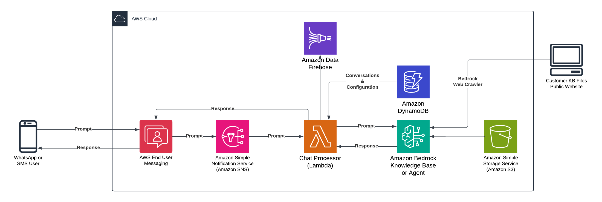

# Multi-channel Chat with AI Agents and Q&A Bots

>**BE AWARE:** This code base is an [Open Source](LICENSE) starter project designed to provide a demonstration and a base to start from for specific use cases. 
It should not be considered fully Production-ready.
If you plan to deploy and use this in a Production environment please review the [Using this in Production](#using-this-in-production) section at the end for some additional guidance.

## Use-case scenario

Demonstrates how you can use AWS End User Messaging 2-way SMS and WhatsApp to send and receive messages from Amazon Bedrock Agents or a Amazon Bedrock Knowledge Base.  You can chat with an Amazon Bedrock Agent or a Bedrock Knowledge base that allows end users to answer questions built off documents stored in S3, or crawled from a public facing website.


## Solution components

On a high-level, the solution consists of the following components, each contained in a separate folder:

* cdk-stacks - AWS CDK stacks:
    - `cdk-backend-stack` with all the backend resources needed for the solution (AWS Lambda, Amazon API Gateway, Amazon Cognito etc)

### Solution architecture:  


## Solution prerequisites
* AWS Account
* AWS IAM user with Administrator permissions
* Amazon Bedrock models: [Bedrock Anthropic Claude 3.0 Sonnet and Titan Text Embeddings V2](https://docs.aws.amazon.com/bedrock/latest/userguide/model-access-modify.html) enabled in your region
* (Optional) Amazon Bedrock Agent: If you want to use the chat processor with an agent instead of a knowledge base, you must have a [Bedrock Agent](https://docs.aws.amazon.com/bedrock/latest/userguide/agent-create.html) created in your region prior to deploying the solution. Sample agents are available in the [Bedrock Agent Samples](https://github.com/aws-samples/amazon-bedrock-agent-samples) repository.
* [Docker](https://www.docker.com/) Installed and Running - This is used locally to package resources for deployment.
* Node (> v18) and NPM (> v8.19) [installed and configured on your computer](https://nodejs.org/en/download/package-manager)
* AWS CLI (v2) [installed and configured on your computer](https://docs.aws.amazon.com/cli/latest/userguide/getting-started-install.html)
* AWS CDK (v2) [installed and configured on your computer](https://docs.aws.amazon.com/cdk/v2/guide/getting_started).
* If configuring SMS: An [ACTIVE SMS Origination Phone Number provisioned](https://docs.aws.amazon.com/sms-voice/latest/userguide/phone-numbers-request.html) in AWS End User Messaging SMS. Note: This must be an Active number that has been registered. Within the US, you can use 10DLC or Toll Free Numbers (TFNs).
* If configuring WhatsApp: An [ACTIVE WhatsApp Origination Phone Number provisioned](https://docs.aws.amazon.com/social-messaging/latest/userguide/getting-started.html) in AWS End User Messaging Social. Note: This must be an Active number that has been registered with Meta/WhatsApp.

## Solution setup

The below instructions show how to deploy the solution using AWS CDK CLI.
These instructions assume you have completed all the prerequisites.

> Note:If you are using a Windows device please use the [Git BASH](https://gitforwindows.org/#bash) terminal and use alternative commands where highlighted.

1. Clone the solution to your computer (using `git clone`)

2. Check AWS CLI
    - AWS CDK will use AWS CLI local credentials and region. These can be either
      - environment variables (AWS_ACCESS_KEY_ID AWS_SECRET_ACCESS_KEY, AWS_SESSION_TOKEN, AWS_DEFAULT_REGION) set directly in the command line
      - from a [credentials file](https://docs.aws.amazon.com/cli/latest/userguide/cli-configure-files.html), either using the default profile or setting a specific one (i.e. `export AWS_PROFILE=yourProfile`)
    - check your AWS CLI configuration by running any AWS CLI command (e.g. `aws s3 ls`)
    - you can confirm the configured region with  
            `aws ec2 describe-availability-zones --output text --query 'AvailabilityZones[0].[RegionName]'`
    - AWS SDK (used in the configure script in step 4) can use either the environment variables or credentials file/profile config, however note that the region environment variable in this case is AWS_REGION rather than AWS_DEFAULT_REGION (as used in awscli)

3. Install NPM packages
    - Open your Terminal and navigate to `two-way-sms-chat-with-a-generative-ai-chatbot/cdk-stacks`
    - Run `npm run install:all`
    - This script goes through all packages of the solution and installs necessary modules (webapp, cdk-stacks, lambdas, lambda-layers)

4. Configure CDK stacks
    - In your terminal,  navigate to `two-way-sms-chat-with-a-generative-ai-chatbot/cdk-stacks`
    - Start the configuration script in interactive mode   
      `node configure.js -i`
    - (You can configure it via single command, by directly providing parameters, as described in the script help instructions which you can see by running 
      `node configure.js -h`)
    - When prompted, provide the following parameters:

        - `sms-enabled`: Set to true to enable SMS support
            - `origination-number-id`: The ID of the Origination Phone number you want to use.  Can be found in the AWS End User Messaging SMS console by clicking on `Configurations -> Phone numbers` and selecting the phone number you want to use.  The ID is the `Phone number ID` column.  NOTE: This number shouldn't be part of a Phone Pool and shouldn't have 2-WAY SMS previously enabled.
            - `configuration-set`: If specified, the solution will use this configuration set for the SMS messages.
        - `whatsapp-enabled`: Set to true to enable WhatsApp support
            - `whatsapp-origination-number-id`: The ID of the Origination Phone number you want to use.  Can be found in the AWS End User Messaging WhatsApp console. 
            - `whatsapp-sns-topic-arn`: The ARN of the SNS Topic that was used when configuring your WhatsApp Business Account.
        - `use-bedrock-agent`: Set to true to use Bedrock Agents for the chatbot. If false, the chatbot will be deployed using the default knowledge base.
            - `bedrock-agent-id`: The ID of the Bedrock Agent you want to use.  Can be found in the Bedrock console.
            - `bedrock-agent-alias-id`: The ID of the Bedrock Agent Alias you want to use.  Can be found in the Bedrock console.
        - `cloudsearch-replicas-enabled`: In order to save costs, you can disable replicas on the CloudSearch collection. We recommend leaving this set to false for development and testing and setting it to true for production environments.
        - `conversation-firehose-stream`: The name of the Firehose Stream to use for storing conversation history.  If not specified, the conversation history will not be stored permanently.

5. Deploy CDK stacks
    - In your terminal navigate to `[repo name]/cdk-stacks`
    - If you have started with a new environment, please bootstrap CDK: `cdk bootstrap`
    - Run the script: `npm run cdk:deploy`
        - On **Windows devices** use `npm run cdk:deploy:gitbash`
        - On **Windows devices** use `npm run cdk:deploy:gitbash`
    - This script deploys CDK stacks
    - Wait for all resources to be provisioned before continuing to the next step
    - AWS CDK output will be provided in your Terminal.

6. (Optional) Configure the following if you opted NOT to use a Bedrock Agent (use-bedrock-agent=false):
    - Add Documents to the S3 Bucket created by the solution. 
        - The bucket name is output by the CDK Deployment.  You can also navigate to CloudFormation in the Console and select the newly created stack and navigate to the `Outputs` tab to see the Stack Outputs.

    > NOTE: Do not upload any documents with sensitive information to the S3 Bucket.  You should only upload documents that are publicly available such as public FAQ documents or other publicly available information.

    - (Optional) If not using a Bedrock Agent, start the Ingestion Job on the Bedrock Knowledge Base S3 Data Source
        - Navigate to `Bedrock -> Knowledge Bases` and select the Knowledge Base created by the solution.  The Knowledge Base name is output by the CDK Deployment.  You can also navigate to CloudFormation in the Console and select the newly created stack and navigate to the `Outputs` tab to see the Stack Outputs.
        - Click on the Knowledge Base to open it
        - Select the Data Source created by the solution.  The Data Source name is output by the CDK Deployment.  You can also navigate to CloudFormation in the Console and select the newly created stack and navigate to the `Outputs` tab to see the Stack Outputs.
        - Click on `Sync` button to start the ingestion job.  This can take a while to complete if the data source is large. 

7. Test the solution
    - Using either SMS or WhatsApp, send  `start` to the AWS End User Messaging Phone Number you selected.  You should receive a response from the solution with instructions to proceed with the demo.

## Bedrock Web Crawler Knowledge Base
By default, the solution will create a Bedrock Knowledge Based using an S3 Bucket as the datasource.  If you would like to use the Web Crawler instead, you can uncomment the WebCrawler section in the `cdk-stacks/lib/cdk-backend-stack.ts` file.  
By default, the solution will create a Bedrock Knowledge Based using an S3 Bucket as the datasource.  If you would like to use the Web Crawler instead, you can uncomment the WebCrawler section in the `cdk-stacks/lib/cdk-backend-stack.ts` file.  

## Conversational Data
This solution will store conversational data in Amazon DynamoDB. Using [DynamoDB TTL](https://docs.aws.amazon.com/amazondynamodb/latest/developerguide/TTL.html), this data is automatically removed after 10 minutes.  This can be configured by changing the `SESSION_SECONDS` variable in the `cdk-stacks/lib/cdk-backend-stack.ts` file.

The `ChatContext` table has the following structure:
- `phoneNumber` (Partition Key) - Incoming phone number
- `messageId` (Sort Key) - The messageId generated by AWS End User Messaging
- `channel` - The channel the message was sent from (text or whatsapp)
- `direction` - The direction of the message (inbound or outbound)
- `knowledgeBaseId` - The ID of the Bedrock Knowledge Base used in the conversation
- `message` - The message sent by the end user or the response from the Bedrock Knowledge Base
- `originationNumberId` - The ID of the Origination Phone number used in the conversation
- `previousPublishedMessageId` - The ID of the previous published message in the conversation. Note this only applies to SMS
- `sessionId` - The Bedrock Knowledge Base Session ID
- `source` - Indicates if the question was answered by a Bedrock Agent, the Bedrock Knowledge Base, or the General LLM
- `timestamp` - The timestamp of the message.  Note: there is a secondary index on phoneNumber and timestamp so that you can query the table for messages sent by a particular phone number and have the conversation ordered chronologically.
- `ttl` - The [DynamoDB TTL](https://docs.aws.amazon.com/amazondynamodb/latest/developerguide/TTL.html) for the message.  This is used to automatically remove the conversation after the conversation has ended.

> NOTE: If you need to use this data for other purposes such as AI/ML training or other analytics, you can deploy the following starter project: [Engagement Database and Analytics Sample For End User Messaging and SES](https://github.com/aws-samples/Engagement-Database-And-Analytics-Sample-For-End-User-Messaging-And-SES) which will deploy an Amazon Data Firehose data stream.  Once that project is deployed you can enable the optional `conversation-firehose-stream` parameter when configuring the solution.  This will send the conversation history to the Amazon Data Firehose Stream.  

The [Engagement Database and Analytics Sample For End User Messaging and SES](https://github.com/aws-samples/Engagement-Database-And-Analytics-Sample-For-End-User-Messaging-And-SES) solution isn't a requirement, but it is a good starting point for using this data for other purposes such as AI/ML training or other analytics. If you don't want to use that sample, you can then configure other destinations for the Firehose Stream such as Amazon S3, Amazon Redshift, or Amazon OpenSearch.

You can also use [DynamoDB Streams](https://docs.aws.amazon.com/amazondynamodb/latest/developerguide/time-to-live-ttl-streams.html) to persist the data in another service.

## Troubleshooting
- If you don't receive a response from the AWS End User Messaging Phone Number you selected, please check the following:
    - Ensure that the phone number you selected is a SMS or WhatsApp enabled End User Messaging number
    - Inspect the CloudWatch Logs for the `ChatProcessor` Lambda function to ensure it is processing messages correctly
        - For more detailed logs you can [Set the Log Level to TRACE](https://docs.aws.amazon.com/lambda/latest/dg/monitoring-cloudwatchlogs-advanced.html#monitoring-cloudwatchlogs-log-level-setting)
    - Check the `ChatProcessor` Lambda function's `Environment Variables` and ensure that the `KNOWLEDGE_BASE_ID` is correct
- Credential Errors:
```
@aws-sdk/credential-provider-node - defaultProvider::fromEnv WARNING:
    Multiple credential sources detected:
    Both AWS_PROFILE and the pair AWS_ACCESS_KEY_ID/AWS_SECRET_ACCESS_KEY static credentials are set.
    This SDK will proceed with the AWS_PROFILE value.

    However, a future version may change this behavior to prefer the ENV static credentials.
    Please ensure that your environment only sets either the AWS_PROFILE or the
    AWS_ACCESS_KEY_ID/AWS_SECRET_ACCESS_KEY pair.
```
Remove either the AWS_PROFILE or the credentials from your environment.

- Docker Errors: 
```
ERROR: Cannot connect to the Docker daemon at unix:///Users/bgiorgin/.docker/run/docker.sock. Is the docker daemon running?
```

Make sure you have Docker installed and running.

```
error getting credentials - err: exec: "docker-credential-desktop": executable file not found in $PATH, out: ``
```

Check your `~/.docker/config.json` for the line saying: `credsStore`. Replace this with `credStore` instead.
ref: https://stackoverflow.com/questions/67642620/docker-credential-desktop-not-installed-or-not-available-in-path
- Credential Errors:
```
@aws-sdk/credential-provider-node - defaultProvider::fromEnv WARNING:
    Multiple credential sources detected:
    Both AWS_PROFILE and the pair AWS_ACCESS_KEY_ID/AWS_SECRET_ACCESS_KEY static credentials are set.
    This SDK will proceed with the AWS_PROFILE value.

    However, a future version may change this behavior to prefer the ENV static credentials.
    Please ensure that your environment only sets either the AWS_PROFILE or the
    AWS_ACCESS_KEY_ID/AWS_SECRET_ACCESS_KEY pair.
```
Remove either the AWS_PROFILE or the credentials from your environment.

- Docker Errors: 
```
ERROR: Cannot connect to the Docker daemon at unix:///Users/bgiorgin/.docker/run/docker.sock. Is the docker daemon running?
```

Make sure you have Docker installed and running.

```
error getting credentials - err: exec: "docker-credential-desktop": executable file not found in $PATH, out: ``
```

Check your `~/.docker/config.json` for the line saying: `credsStore`. Replace this with `credStore` instead.
ref: https://stackoverflow.com/questions/67642620/docker-credential-desktop-not-installed-or-not-available-in-path

## Clean up

To remove the solution from your account, please follow these steps:

1. Remove CDK Stacks
    - Run `cdk destroy --all`

2. Remove deployment parameters from AWS System Manager Parameter Store
    - Run `node configure.js -d`

3. Verify any OpenSearch Serverless vector datastores have also been removed.  If not removed, this could incur high costs.

## Using this in Production

It is critical that before you use any of this code in Production that you work with your own internal Security and Governance teams to get the appropriate Code and AppSec reviews for your organization. 

Although the code has been written with best practices in mind, your own company may require different ones, or have additional rules and restrictions.

You take full ownership and responsibility for the code running in your environment, and are free to make whatever changes you need to.

**Some of the things you will want to consider**
- The starter project creates an S3 bucket to store the documents used for the Bedrock Knowledge Base.  You may want to use [Amazon Macie](https://docs.aws.amazon.com/macie/latest/user/what-is-macie.html) to assist in discovery of potentially sensitive data in S3 buckets.  Amazon Macie can assist in discovery of potentially sensitive data in S3 buckets, and can be enabled on a free trial for 30 days, up to 150GB per account.
- Consider enabling model invocation logging and set alerts to ensure adherence to any responsible AI policies. - Model invocation logging is disabled by default. See https://docs.aws.amazon.com/bedrock/latest/userguide/model-invocation-logging.html
- Bedrock Guardrails - A customer may want to restrict Bedrock output for compliance, abuse mitigation, or other data restrictions. Guardrails for Amazon Bedrock, AWS Lambda, or AWS Comprehend may be good candidates to redirect and filter Bedrock output. See https://aws.amazon.com/bedrock/guardrails/
- The starter project has extensive logging to CloudWatch, but does not have any monitoring or tracing included, you may want to look at using tools like Cloudwatch Alarms and X-ray.
- The starter project tags all resources with the tags listed in `cdk-stacks/config.params.json` and anything created through the dashboard has the tags in `cdk-stacks/lambdas/constants/Tags.js` added. You may wish to replace them with your own company requirements, or tag at a more granular level.
